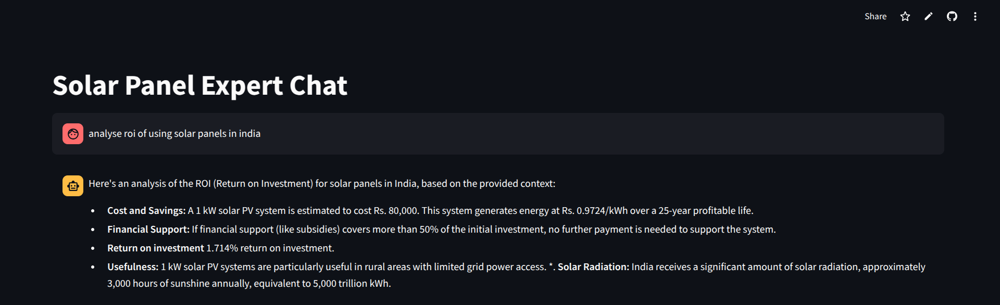
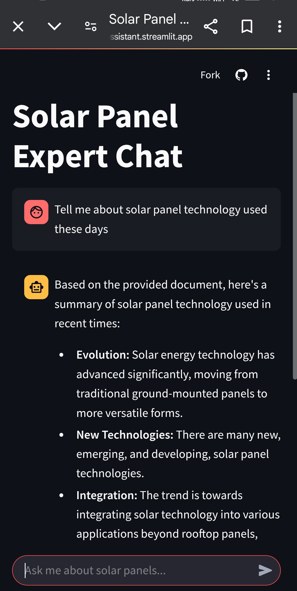
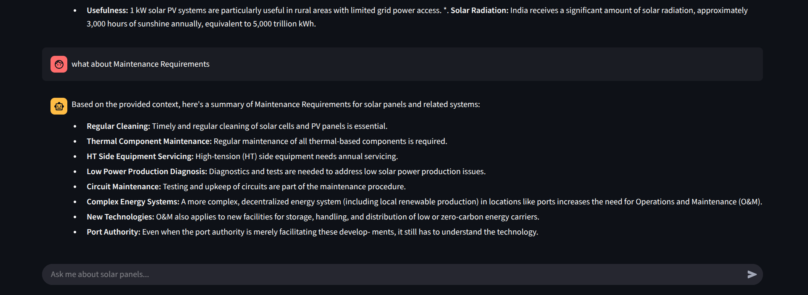

# Solar Panel Expert Chat Application

This project is a Streamlit-based chat application that leverages a custom knowledge base built using LlamaIndex and Hugging Face embeddings, integrated with the OpenRouter API (using the Gemini model) for expert responses on solar panel technology.

[Live Link](https://solar-industry-ai-assistant.streamlit.app/)

## Table of Contents
- [Project Setup Instructions](#project-setup-instructions)
- [Implementation Documentation](#implementation-documentation)
- [Example Use Cases](#example-use-cases)
- [Future Improvement Suggestions](#future-improvement-suggestions)
- [Screenshots](#screenshots)

## Project Setup Instructions

1. **Clone the Repository:**
   ```bash
   git clone https://github.com/ShlokArora2709/Solar-Industry-Ai-Assistant
   cd solar-panel-chat-app
   ```

2. **Install Dependencies:**
   It's recommended to use a virtual environment:
   ```bash
   python -m venv venv
   source venv/bin/activate  # On Windows use `venv\Scripts\activate`
   pip install -r requirements.txt
   ```

3. **Configure Environment Variables:**
   Create a `.env` file at the project root with the following content:
   ```env
   OPENROUTER_API_KEY=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
   ```

4. **Set Up the Vector Store:**
   This step is not neccessary as vector store already exists but you can rebuild it by running `knowledgeScript.py`. It will download pdfs from internet and convert it into a vector store.

5. **Run the Application:**
   Launch the Streamlit app:
   ```bash
   streamlit run app.py
   ```

## Implementation Documentation

- **Knowledge Base:**
  - Built using LlamaIndex with Hugging Face embeddings (model: `BAAI/bge-small-en-v1.5`).
  - Processes PDF documents related to solar panel technology and stores them in a vector database for efficient retrieval.

- **Chat Interface:**
  - Developed with Streamlit to provide a conversational UI.
  - Retrieves relevant context from the knowledge base and passes the full chat history as context to the OpenRouter API, ensuring high-quality, context-aware responses.

- **OpenRouter API Integration:**
  - Uses the Gemini model for generating detailed, structured, and concise answers.
  - Incorporates prompt engineering to guide the response format (e.g., using bullet points where appropriate).

- **File Structure:**
  ```
  solar-panel-chat-app/
  ├── app.py                 # Main Streamlit application
  ├── my_utils.py            # Some helper functions for clean code
  ├── knowledgeScript.py     # Download pdfs from internet and make vector DB
  ├── requirements.txt       # Python dependencies
  ├── vector_db/             # Persisted vector store from LlamaIndex
  ├── pdf_files/             # Source PDFs for building the knowledge base
  ├── images/                # Screenshots and images for documentation
  ├── .env                   # Environment variables file
  └── README.md              # This documentation
  ```

## Example Use Cases

- **Technical Support:**
  - Users can ask questions regarding solar panel installation, maintenance, and ROI, receiving expert-level, tailored responses.
  
- **Industry Analysis:**
  - Market researchers can query the system for the latest trends, regulatory updates, and technological advancements in solar panel technology.
  
- **Educational Purposes:**
  - Instructors and students can utilize the application as a learning tool to understand complex concepts in renewable energy technology.

## Future Improvement Suggestions

- **Enhanced OCR Capabilities:**
  - Integrate OCR (e.g., using Tesseract) to process scanned PDFs that include images and diagrams.
  
- **Improved Multi-turn Dialogue:**
  - Enhance context retention to allow for more natural multi-turn conversations and better handling of follow-up questions.
  
- **Scalability Enhancements:**
  - Consider integrating a production-grade vector database (such as FAISS, Pinecone, or Chroma) for improved performance and scalability.
  
- **User Feedback Loop:**
  - Implement mechanisms to capture user feedback to refine and improve response quality over time.

## Screenshots

<div align="center">
  <table>
    <tr>
      <td></td>
      <td rowspan="2"></td>
    </tr>
    <tr>
      <td></td>
    </tr>
  </table>
</div>

